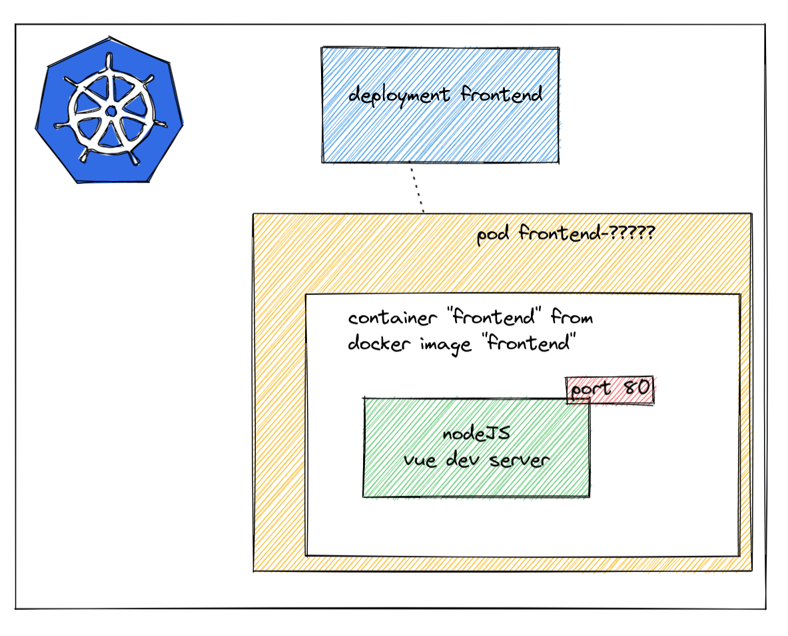

# Going to kubernetes with our application!

## Pushing our container images to the registry (in kubernetes)

So... we have a docker registry running on kubernetes, which was called `registry.kube-public`. In docker, if you want to push an image to a container registry, you need to name/tag it so its called `[registry-url]/[image-tag]`. WE didn't do this for our frontend nor backend. let's do it! now!

```shell
## frontend!
docker tag myfrontend registry.kube-public/myfrontend
docker push registry.kube-public/myfrontend

## API!
docker tag myapi registry.kube-public/myapi
docker push registry.kube-public/myapi
```

Ok! so now our docker images are in a docker registry that is accessible by kubernetes. We can now try to run it!

## Creating a deployment for our frontend

Let's create a frontend kubernetes Deployment (doesn't matter where, we will move it later):

```yaml
apiVersion: apps/v1
kind: Deployment
metadata:
  name: frontend
  labels:
    app: frontend
spec:
  replicas: 1
  selector:
    matchLabels:
      app: frontend
  template:
    metadata:
      labels:
        app: frontend
    spec:
      imagePullSecrets:
        - name: registry-creds
      containers:
        - name: frontend
          image: registry.kube-public/myfrontend
```

Now we need to apply it with `kubectl apply -f [thefile.yaml]`. If you get ImagePullBackoff you still need to create your image pull secret (see the first chapter for details).


Let's check if we can see the deployment:

```shell
kubectl get deployment
```

a deployment should create pods, so let's check if they are there:

```shell
kubectl get pod
```

The same should be possible in k9s: you can go to the deployments by typing `:` followed by *deploy*.


Questions!

* Can you try to scale our deployment up and down ? using k9s ? using kubectl?
* Can you port-forward our deployment to something on our computer (shift-f in k9s)?
* Ok, next up is helm. Let's clean up and remove our deployment. We'll recreate it soon using helm. Try cleaning up the deployment using kubectl!


## Wrapping up

So, we now created a **deployment** that in its turn created a **pod**. This pod has one container (because it is created from a pod template that specifies one single container) created from the docker image `registry.kube-public/myfrontend`.



