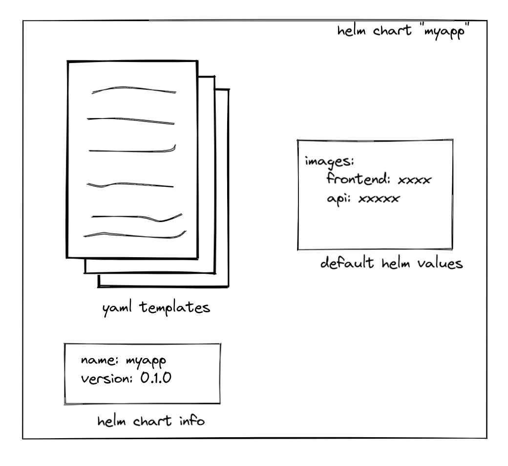
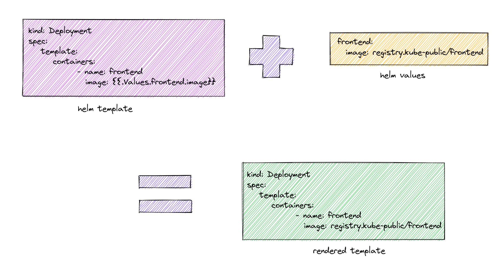

# Creating a helm chart

So now we want to create a helm chart. You could see a helm chart as a collection of yaml files (in the last excercise we had only one or two yaml files but in a real application this will typically grow). Helm keeps your collection nicely together, allowing you to install/uninstall them in one go and also allows you to make some things configurable in your yaml files (it allows you to use **template variables** in your yaml files).

Helm is actually really simple, let us show you:

## Getting started.

Let's get started. Make sure you are in the root directory of this project (should be "skaffold-helm-tutorial") and do:

```shell
helm create myapp
```

Now we have some work to do:

* helm creates a lot of stuff to explain helm, we don't need it! make the file `values.yaml` empty, and remove all files and directory under the `templates` folder, but keep the templates folder!
* now move our deployment yaml from last excercise to the templates folder and .. voila we have a working helm chart (albeit not a very useful one)

We can try to install it:
```shell
helm install myapp-deployment-1 myapp
```

Did it work ? Let's quickly remove it so we can make it more useful!

```shell
# let's look at which helm packages we installed. note that helm packages are namespaced, so you will only see the helm packages installed in current namespace.
helm list
# if you want to list/install/uninstall in another namespace, use the `-n [namespace]` option. 
helm uninstall myapp-deployment-1
```

## Introduce stuff that's configurable

Let's put the following in values.yaml:

```yaml
frontend: 
  image: registry.kube-public/myfrontend
```

Note that our values.yaml is a free form yaml. as long as its valid yaml you can put anything there.

Let's now adapt our deployment yaml for the frontend so it uses the value from values.yaml instead of the hardcoded one:

```yaml
apiVersion: apps/v1
kind: Deployment
metadata:
  name: frontend
  labels:
    app: frontend
spec:
  replicas: 1
  selector:
    matchLabels:
      app: frontend
  template:
    metadata:
      labels:
        app: frontend
    spec:
      imagePullSecrets:
        - registry-creds
      containers:
      - name: frontend
        image: {{ .Values.frontend.image }}
```

Now we can actually vary our image using this syntax:

```shell
helm install myapp-deployment-1 myapp --set frontend.image=some.invalid/image
```

Questions:

* How does kubernetes react to our invalid image ?
* Can you clean up our helm chart again ?
* Can you also make the number of replicas configurable and try setting them using helm ?
* Do you think it is really needed to completely uninstall/reinstall a helm chart after making changes ?

## Introducing a service for the frontend

You can now append the following section to our deployment yaml we created earlier. Note that the `---` separates multiple objects in one yaml file. You could also just have started a new file. personal preference.

```yaml
---
apiVersion: v1
kind: Service
metadata:
  name: frontend
spec:
  ports:
  - port: 80
    targetPort: 80
    name: frontend
  selector:
    app: frontend
```

## Deploying the API

Let's make this quick. in values.yaml, add a section for the backend:

```yaml
backend: 
  image: registry.kube-public/myapi
```

Now let's create an `api.yaml` under templates:

```yaml
apiVersion: v1
kind: Service
metadata:
  name: api
spec:
  ports:
  - port: 80
    targetPort: 80
    name: http
  selector:
    app: backend
---
apiVersion: apps/v1
kind: StatefulSet
metadata:
  name: api
  labels:
    app: api
spec:
  serviceName: api
  replicas: 1
  selector:
    matchLabels:
      app: api
  template:
    metadata:
      labels:
        app: api
    spec:
      imagePullSecrets:
        - registry-creds
      containers:
      - name: api
        imagePullPolicy: Always
        image: {{ .Values.images.api.image }}
```

Questions:

* Does it work ? Can you fix it ? What's wrong (hint: two things are wrong) ?
* Why are we using a statefulset instead of a deployment here ?

<details>
  <summary>Click here to see why it didn't work!</summary>
  
There are actually two errors in the configuration above:
* The image doesn't refer to the right section in the yaml file. there is no "images.api.image", only an "backend.image"!
* The selector in the service doesn't select the pods from the statefulset. Can you fix it ?

</details>

Now that everything is fixed, more questions:

* Can you look at the logs from the frontend container in kubernetes ? What do you see ?

## Wrapping up and undrestanding what happens

So we created a helm chart, which is basically a collection of templates, default values and some information like the name and version:



Now what does helm actually do when you install the chart ?
It basically takes the values (either the default values that are part of the helm chart or, if the user specified any, the values specified by the user), and turns the yaml templates into "ordinary" yaml files!

... like so:



So this means that kubernetes never actually sees the helm values[^1]: helm first renders the templates to ordinary yamls and only then it sends them to kubernetes.

Actually, it is even possible to ask helm to render the templates to yaml files to files so you can kubectl apply them. This is done by the `helm template` command. Let's try this (from the parent folder of the "myapp" helm chart):

```shell
helm template myapp-installation myapp > myapp-installation.yaml
```

Now inspect the resulting myapp-installation.yaml in your editor.


[^1]: Actually helm also stores the values as a `secret` in kubernetes just for reference. But this is internal helm stuff, we should not rely on it.

> **_WARNING_**: Understanding the concepts and what every layer does (containers, images, the docker build, kubernetes, helm) is critical for being able to work with kubernetes without frustration.  If you are already a bit confused now, make sure to clear this up before continuing with the next chapter. In the next chapter we will add **another** layer so if you're already confused now you will be completely confused next chapter.
