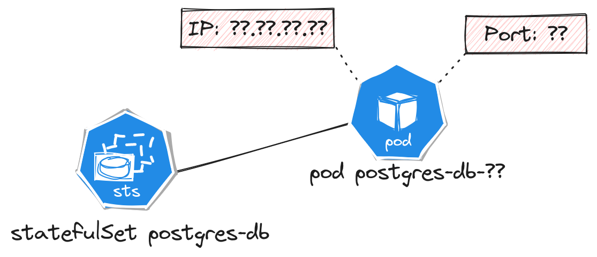
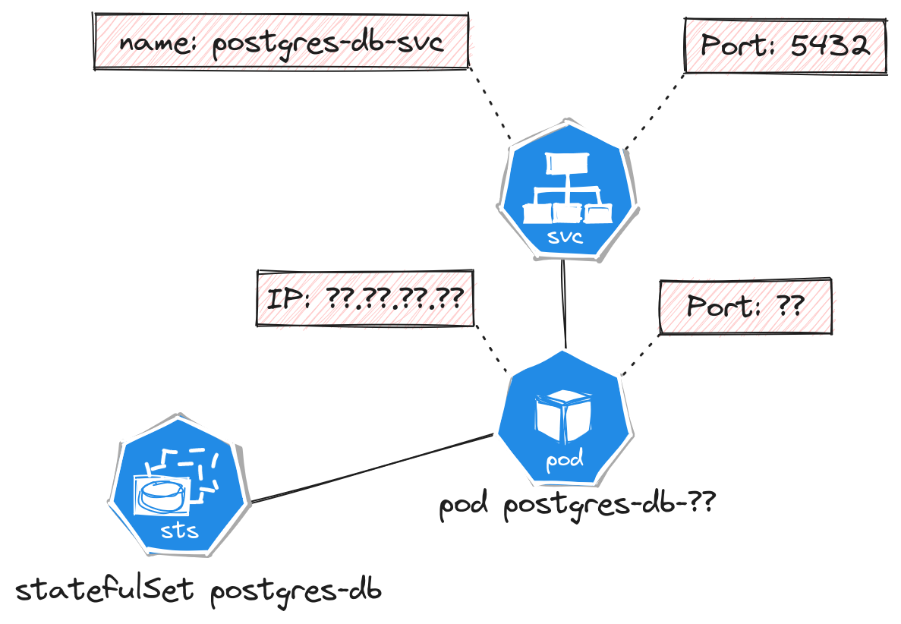

## Linking our database to our deployment through a Service

We now have multiple pods that could communicate through their ip address. let's imagine you want to connect to the database from the frontend deployment: host would require an IP adress or a name. You can retrieve the IP address of the database pod generated from the statefulset using this command:

```bash
kubectl get pod <<db-pod-name>> --template '{{printf "%s\n" .status.podIP}}'
```


Let's lookup this pod from our frontend:

```bash
kubectl exec -it <<frontend-pod_name>> -- nslookup <<db-pod-ip>>
```

- Delete the statefulSet and recreate it. What happen to the IP address?

It changes! 

This IP is randomly chosen in a range of available address. Obviously it makes it not possible to work with pods as is, as we would need to update all the referenced ip between pods each time we have a new version, without knowing them.



To solve this, we got services!

## Getting Started

let's apply the following yaml:

```yaml
apiVersion: v1
kind: Service
metadata:
  name: postgres-db-svc
spec:
  selector:
    app: postgresql-db
  ports:
  - port: 5432
```

This will serve as the front door of a pod selected because it has a label app set as "postgresql-db". It matches the label we have set on the statefulSet! And that's not all! services can be linked to multiple pods having the same label and will in that case also be a load balancer between them. 



-> We can use name of the service as an endpoint to access the pod! 

```bash
kubectl exec -it <<frontend-pod_name>> -- nslookup postgres-db-svc
```


## Wrapping up and undrestanding what happens

* Ok, next up is helm. Let's clean up and remove our deployment, statefulset and volume. We'll recreate them soon using helm. Try cleaning up the deployment using kubectl!
* Services provide reliable endpoints inside a Kubernetes cluster, but do not expose them outside of the cluster. For this, we have ingresses that will be covered later

## To go further

* We only covered the default services of type ClusterIP. Services have other types for other needs as explained in the [official documentation](https://kubernetes.io/docs/tutorials/kubernetes-basics/expose/expose-intro/).